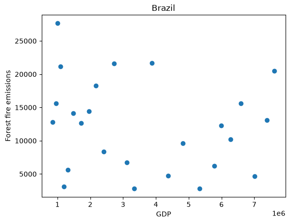
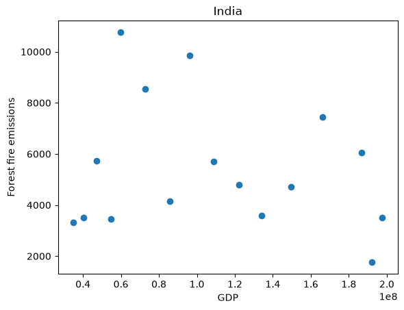
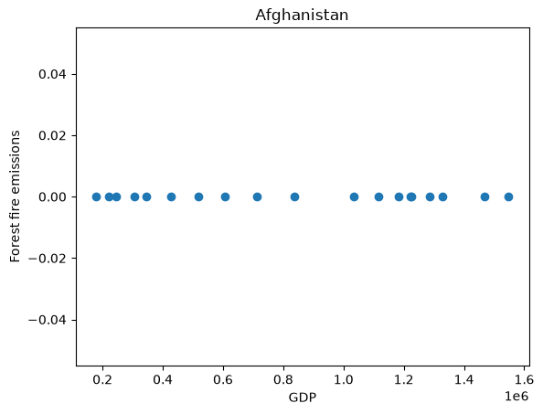

# tdd

Download the full datasets into the top-level `data/` directory.
These files are not committed to the repository.

##Introduction

This analysis examines the relationship between forest fire emissions and
gross domestic product (GDP) for Brazil, India, and Afghanistan. Each
country was analyzed separately because GDP is reported in each country's
local currency and values are therefore not directly comparable across
countries.

##Results

### Brazil
Forest fire emissions and gross domestic product (GDP) for Brazil were
highly variable across the observed GDP range, with no clear linear
relationship between GDP and forest fire emissions.



### India
Forest fire emissions and gross domestic product (GDP) for India were also
highly variable across the observed GDP range, with no clear linear
relationship between GDP and forest fire emissions.



### Afghanistan
Forest fire emissions were approximately zero across the observed GDP
range in Afghanistan, with little to no variation in forest fire
emissions across the available years.




##Methods

Forest fire emissions and GDP data were combined by country and year.
The CO2 dataset contains one row per country per year, while the GDP
dataset contains one row per country with years stored across columns.

The functions in `src/fire_gdp.py` were used to read and combine the
datasets. `get_data()` was used to read the files and select rows for a
specific country. `get_column_index()` was used to identify the Forest
fires column and the matching year in the GDP dataset.
`get_fire_gdp_year_data()` then matched forest fire emissions and GDP
values by year. Years with missing forest fire or GDP values were
excluded.

Scatterplots were generated separately for Brazil, India, and
Afghanistan using `src/plot_fire_gdp.py`. GDP was plotted on the x-axis
and forest fire emissions on the y-axis. Countries were analyzed
separately because GDP is reported in each country's local currency and
is not directly comparable between countries.
 
###plots were generated with 

Brazil:

python3 src/plot_fire_gdp.py \
    --co2 data/Agrofood_co2_emission.csv \
    --gdp data/IMF_GDP.csv \
    --country Brazil \
    --out results/brazil.png

India:

python3 src/plot_fire_gdp.py \
    --co2 data/Agrofood_co2_emission.csv \
    --gdp data/IMF_GDP.csv \
    --country India \
    --out results/india.png

Afghanistan:

python3 src/plot_fire_gdp.py \
    --co2 data/Agrofood_co2_emission.csv \
    --gdp data/IMF_GDP.csv \
    --country Afghanistan \
    --out results/afghanistan.png


```
curl -L "https://docs.google.com/uc?export=download&id=1AsXP_OGs1O_TDeXiZjk3fYV1SrG4vwXF" -o data/Agrofood_co2_emission.csv
curl -L "https://docs.google.com/uc?export=download&id=19YEPysdnK7VCXuAe9Og9pwYkNT5CbQzr" -o data/IMF_GDP.csv
```