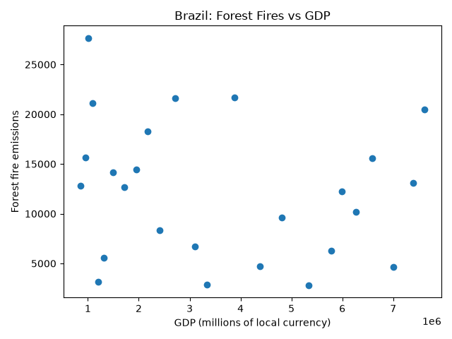
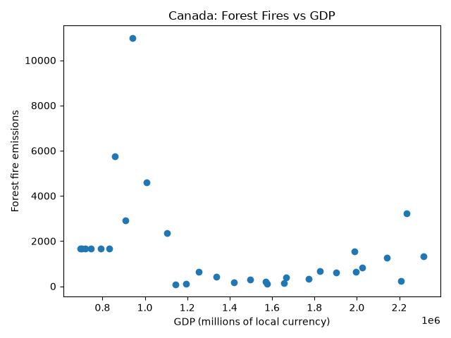
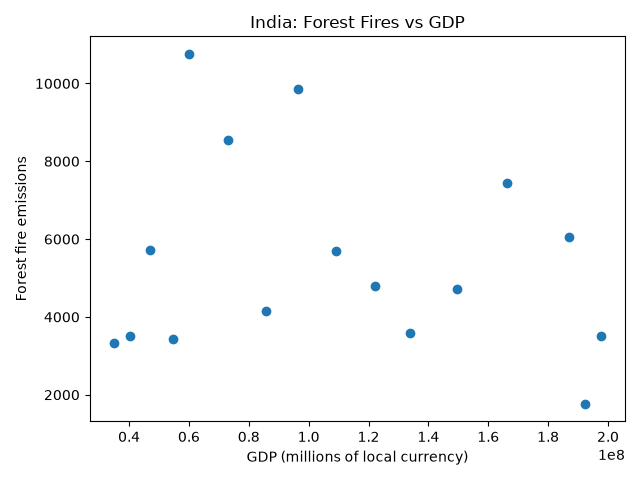

## Introduction

This project examines the relationship between forest fire emissions and gross domestic product (GDP) in Brazil, Canada, and India. The objective is to determine whether changes in economic activity are associated with changes in forest fire emissions. Each country is analyzed independently because GDP is reported in millions of its local currency.

## Results

Scatter plots were generated to compare forest fire emissions and GDP for each country.

### Brazil



Brazil exhibits considerable variability in forest fire emissions across different GDP levels. The results do not indicate a clear linear relationship between GDP and forest fire emissions.

### Canada



Canada shows several observations with relatively high forest fire emissions at lower GDP levels. Most observations at higher GDP levels exhibit lower emissions, although exceptions occur.

### India



India shows substantial variation in forest fire emissions across GDP levels, with no clear increasing or decreasing linear relationship.

Overall, the results suggest that GDP alone is not a consistent predictor of forest fire emissions across these three countries. Additional environmental and climatic variables may be necessary to explain the observed variability.

## Methods

Two datasets were used: `Agrofood_co2_emission.csv`, containing forest fire emissions by country and year, and `IMF_GDP.csv`, containing annual GDP values.

Python functions were developed using test-driven development to read CSV files, identify columns, filter countries, and match forest fire emissions with GDP by year. Years with missing emissions or GDP values were excluded.

Matplotlib was used to generate scatter plots for each country.

After downloading the datasets using the commands at the beginning of this README and installing the required Python dependencies, the plots can be reproduced by running:

```bash
python src/plot_fire_gdp.py --country Brazil --out brazil.png
python src/plot_fire_gdp.py --country Canada --out canada.png
python src/plot_fire_gdp.py --country India --out india.png
```

Unit tests and functional tests were used to verify the data-processing and plotting functionality.